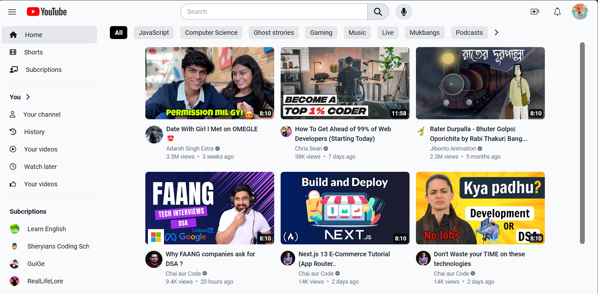

# YouTube Clone - HTML & Tailwind CSS

This repository contains code for a YouTube website clone created using HTML and Tailwind CSS. The clone is designed to be fully responsive, offering a seamless experience across different screen sizes.

### [Live Website here](https://manikmaity.github.io/YouTube-Clone/)

## Website Preview
### Desktop Preview

## Features

- Faithful reproduction of the YouTube website design.
- Responsiveness for various devices and screen sizes.
- Customizable and extendable codebase built with HTML and Tailwind CSS.

## License

This project is licensed under the MIT License - see the [LICENSE](LICENSE) file for details.

---

